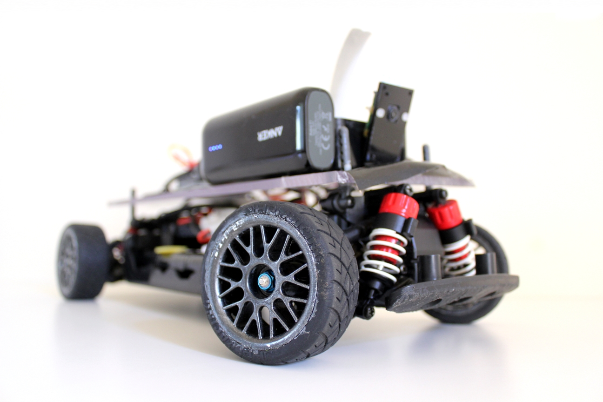

# RCAutopilot
__Note: Documentation for this repository is still in progress and there may be omissions__

You can see the car in action here:

## Overview
This is a small scale demonstration of how a self-driving system could be implemented using a toy radio controlled car by having the car drive itself around a well defined track. This project has been implemented mainly in Python with a bit of C/C++ needed for the Arduino.

__Acknowledgements__

SullyChen's Autopilot-Tensorflow project was used and slightly adapted to generate the steering angles for the car when driving in Autonomous mode. He based his tensorflow implementation on a convolutional neural network described in a Nvidia paper. You can see his project here: https://github.com/SullyChen/Autopilot-TensorFlow

Hamuchiwa's AutoRCCar project was a big inspiration when I created this project. The object recognition in my project is heavily based on his implementation and currently still uses the Haar cascade classifier he created to detect stop signs. You can follow his project here: https://github.com/hamuchiwa/AutoRCCar

### How it works

A convolutional neural network (CNN) is used to generate steering angles based on video fed from the front of the car. For this to work, the network first needs to be trained. A user would have to manually drive the car and "show" the neural network how the car should handle itself around the track. This would include images of what the car "sees" as well as the input the user is giving under those conditions. Once the CNN has been given this data, it will train itself and create a model of how the car should be driven around the track. The car can now use this model to navigate its way along the track. If the track is heavily changed or the lighting conditions become drastically different to when CNN was originally trained, it may need to be retrained for the new conditions.
In the project's current implementation, only steering angles are generated. The user manually sets a cruising throttle that the car should be at.
Haar cascades are then used on top of all that to do some object detection. This is used to detect "Stop signs" for example.

__Training__

Before the car can be run in autonomous mode, it needs to be manually trained (my trained model is included). Video is captured by the Raspberry Pi using the Camera Module which is mounted on top of the car. This video is streamed over the wifi network to the PC. A gamepad connected to the PC is used to manually control the car. Each frame of video received is stored on the PC, along with the corresponding user input (steering input and throttle input). The user has to manually drive the car around the track numerous times to collect sufficient training data and cover the different conditions that the car may encounter.
Once the training is complete, a script needs to be run to train the model. Depending on the number of images and the processing power of the PC, the training process can take a few hours. Once the training is complete, a file is produced containing the trained model.

__Driving__

Once the trained model has been obtained, the car can be run in autonomous mode. Once the car is set to autonomous mode and a desired speed is selected, the PC takes the input image streamed from the Raspberry Pi, processes it using a convolutional neural network, and generates an appropriate steering angle. This steering angle is then sent back to the Raspberry Pi over wifi. An Arduino is connected to the Raspberry Pi over USB, and this steering angle is sent to the Arduino. The Arduino is connected to the ESC and steering servo and provides them with the appropriate PWM signal to it, ensuring the car drives at the specified speed and turns by the required amount.

## Prerequisites
### Components
These are the components I used to make this project. These aren't set in stone, and can be substituted for other parts that may do a similar or even better job
- Raspberry Pi 3
- Rapberry Pi Camera Module
- Portable Power Bank (Anker Astro E1 5200 mAh)
- Arduino Uno Rev 3
- Modified Tamiya Ford Focus RS WRC 02 Chassis
  - TL-01 Chassis
  - TBLE-02S Electronic Speed Control (ESC)
  - 7.2V 3000 mAh NiMH battery
- PC
  - Dedicated graphics card can help speed up training
- TP-Link TL-WR702N Nano Router (optional)
- Xbox One controller (code can be altered to work with other controllers if they can be recognised on Ubuntu)
- Wires
### Software
The PC should be running Ubuntu (or equivalent). The following software packages should be installled:
- Xbox drivers for Ubuntu (xboxdrv)
- Python 2
- Pygame: 1.9.1
- Numpy: 1.11.0
- Tensorflow: 1.1.0
- OpenCV: 2.4.13
- Scipy: 0.17.0
- Netifaces: 0.10.4

If you're using Anaconda to create a virtual environment, I've generated a .yml file from my working environment which you can use to create a virtual environment for this project with all the required Python dependancies automatically downloaded (and probably a few packages that aren't actually needed!). This is probably the best way to ensure that all the required dependancies are installed. To follow this method, these are the steps:
- Ensure Anaconda is installed on your machine
- Download the rcautopilot_env.yml file in the root directory
- Follow the instructions [here](https://conda.io/docs/user-guide/tasks/manage-environments.html#creating-an-environment-from-an-environment-yml-file) to create the environment from the .yml file
- Now to ensure you use that environment in your project, set the interpreter of your IDE to the RCAutopilot enviroment that was just created. I used PyCharm to develop this project and [these are the instructions](https://www.jetbrains.com/help/pycharm/configuring-python-interpreter.html) to set the interpreter for it.
- Note: This only installs the Python dependancies. You still need to install xboxdrv manually but this can be done easily using apt-get. It might also be helpful to download jstest-gtk to help check and calibrate the gamepad.

## How to set up the project
### Wiring
*Note: On my Tamiya RC Car, the steering is controlled by a servo and the throttle is controlled by an ESC. The ESC can also be treated as a servo on the Arduino, making it easier to send control signals to it.* 
- Connect the PWM pin (white wire) for the ESC (controlling main forwards/backwards motor) to pin 9 of the Arduino
- Connect the PWM pin for the front steering servo (controlling left/right steering - yellow wire on mine) to pin 8 of the Arduino
- Ensure ESC is common grounded with the Arduino by connecting ground of ESC (black wire) to the GND pin on the Arduino

### ESC Calibration
*Note: These instructions apply to the ESC I used. Mine required calibration to work, but others might not. You might also be able to use a Motor Controller instead of an ESC to run the motors but the Arduino file provided will need to be edited accordingly.*

Chances are, the ESC is calibrated to be used with a RC receiver. The PWM signal from the receiver may be different from the PWM signals generated by the Arduino. To fix this, the ESC needs to be recalibrated with PWM signals from the Arduino. This is a rough guideline on how to achieve this (alternatively, you can use [this sketch](https://github.com/UvinduW/Project-Intelligent-Car/blob/master/Arduino/arduino_dev_files/arduino_control_test/arduino_control_test.ino) which performs the same task on a different project):

__Create Arduino Sketch__
- Create new Arduino source file (.ino file)
- Import the Servo library
- Create a servo variable for the drive motor (eg `Servo driveMotor;`)
- Attach pin 9 to the drive motor variable in setup (eg. `driveMotor.attach(9);` )
- Write script that will take a number between 0 and 180 from the Serial monitor and write it to the Servo declared above
- Upload this sketch to the Arduino

__Put ESC into Calibration mode__
- First, throttle input to ESC should be set to neutral. Do this by writing `90` to the servo above (using the Serial Monitor)
- To put the ESC into Calibration mode, follow the instructions under "High Point Setup" here: https://www.tamiyausa.com/pdf/manuals/45057ml.pdf
- When the instructions ask you to provide full throttle, write `0` to the servo
- When instructions ask you to provide full brakes, write `180` to the servo

If you completed that without a problem, the ESC should now be calibrated! You can test it by writing different values to the Servo and seeing how the motor reacts. Writing a `90` should neutral the motor so it stops spinning. As you decrease towards `0` the motor should speed up. Between `90` and `180` is braking action, or reverse if it is enabled on the ESC. To engage reverse you may need to input a `neutral-brake-neutral-brake/reverse` sequence eg. writing the following in succession to the servo: `90`, `120`, `90`, `120`. 

### Connecting Components
The Raspberry Pi Camera Module should be connected to the Raspberry Pi using the ribon cable. Mount the Raspberry Pi and the camera on the car. Ensure camera is positioned such that it has a clear view of the track ahead. Connect the Arduino to the Raspberry Pi via a USB cable. Place the power bank on the car and connect it up to power the Raspberry Pi. The powerbank can be disconnected when not in use or when testing on a bench with a powersource already available.

### Setting up the scripts
The Arduino sketch in the `\Arduino\Tamiya_Control\` folder should be uploaded to the Arduino. This can be done by installing the Arduino IDE on the Raspberry Pi directly, or by connecting the Arduino to the PC to upload the sketch, and then connecting it back to the Raspberry Pi.

The script in the "Raspberry Pi" folder should be copied to the Raspberry Pi and the scripts in the PC folder should be copied to the computer running Ubuntu.

At the top of the `Combined_Client.py` script on the Raspberry Pi, ensure the IP address is that of the PC that will be receiving the video stream and computing commands. Also ensure that the port number matches that in the `Gamepad_Driver_Server.py` script on the PC. Also note that the Serial port name given to the Arduino USB port may differ from `ttyACM0`. You can determine the Serial port name by running `dmesg | grep tty` in terminal.

In the `Gamepad_Driver_Server.py` file in the PC folder, near the bottom of the file under the comment `Get PC IP Address` the `wlp3s0` and the `enp4s0` refer to the wireless and wired network interfaces available on my PC. These may be different on yours, and you should change them to match the interfaces on your PC. You can obtain the name by entering `ifconfig` into a terminal window. These lines are used to obtain and display the IP address of the current PC. If you have trouble with these lines, you can remove the `ni.ifaddresses('wlp3s0')` line and set `wifi = 0` and `ethernet = 0` to avoid errors.

### Setting up the track
The track should have good contrast between the driveable and non-driveable areas. My track was a black "road" built on a white surface. I used white tabletops as my platform and used adhesive black vinyl to make the road. If you chose not to train a neural network, the included trained model will likely only work in a similar "black track on white surface" setup.

## How to run the project
### General Setup
- Raspberry Pi should be connected to the same network as the PC
- VNC into it (SSH should work too, though not tested)
  - Default Username: pi; Default Password: raspberry
  - Remote Desktop Viewer on Ubuntu should work for VNC
- The only script that needs to be run on the Raspberry Pi is `Combined_Client.py`. This script should be run only after the script on the PC has started. Use VNC on the PC to easily launch the script on the Raspberry Pi.
- I used the TP-Link wireless router as a dedicated network for this project but you should be able to use any unrestricted wireless network

### Collecting Training Data
Note: You can skip this step if you want to try out my existing trained model (the `model.ckpt` file included in the repository). Chances are though, it won't do well with your track as it has been specifically trained on mine (and it isn't an elaborate track)
- Open `Gamepad_Driver_Server.py`
- Ensure the image capture variables are set to allow image
	capture and the starting number for the images is appropriate
- Ensure gamepad is connected to computer before running the script
- Run the script
- Run the `Combined_Client.py` script on the Raspbery Pi
- Wait for camera display to show up on PC
- With default user configurable settings, the car will start off in Autonomous mode. Press `Start` on the gamepad to switch to Manual mode
- Press `A` on the gamepad to start recording images if image
	capture is paused
- Check `training_images` folder to ensure images are being captured
- To pause capture, press `A` again on the gamepad
- To end the script press `B` on the gamepad
- Images should now be found in the `training_images` folder
- Move the images so that they are in the `training_images` folder
	in the `Training Scripts` folder
- Open the `train.py` file
- Adjust epochs or other necessary settings
- Run the script
- Generated file can be found in the `save` folder within the `Training Scripts` folder with the file
	name `model.ckpt`
- Copy this file to the `save` folder within the `PC` folder
	so the main script to drive the car can access it
  
### Playing back collected images with the trained CNN model
If you want to playback the images you collected in the training process to see what the trained Convolutional Neural Network would predict, do the following:
- Go to the `Training Scripts` folder
- Open and run the `run_dataset_edit.py` file 

### Drive car in Autonomous mode
- Open `Gamepad_Driver_Server.py`
- Ensure all user configurable settings are set as needed
- Ensure gamepad is connected to computer before running the script
- Run the script
- Wait until IP address is printed in the terminal
- Ensure client script on Raspberry Pi has same IP address
- Run the script on the Raspberry Pi
- Wait for camera feed window to show on computer
- Now the car should be ready. It starts off in autonomous mode with zero
	throttle
- Use gamepad keys as follows:

	| Key | Action |
	| --- | --- |
	| Start | Toggle between manual and autonomous mode |
	| Right trigger | Forwards throttle |
	| Left trigger | Reverse throttle |
	| Left thumbstick | Steering input (needs to be centered properly for autonomous mode to activate - otherwise it can think there is some manual input being given) |
	| A | Toggle capturing images to disk |
	| B | Quits the script |
	| X | Decrement speed of car when in autonomous mode |
	| Y | Increment speed of car when in autonomous mode |

	Note: If car is in autonomous mode, it will revert to manual mode if gamepad is also giving driving commands. Once the gamepad input stops, it will revert back to autonomous mode.

## To do:
- Small bug in stop sign recognition code needs to be fixed
- Add menu system that can be navigated using gamepad to change settings on the fly
